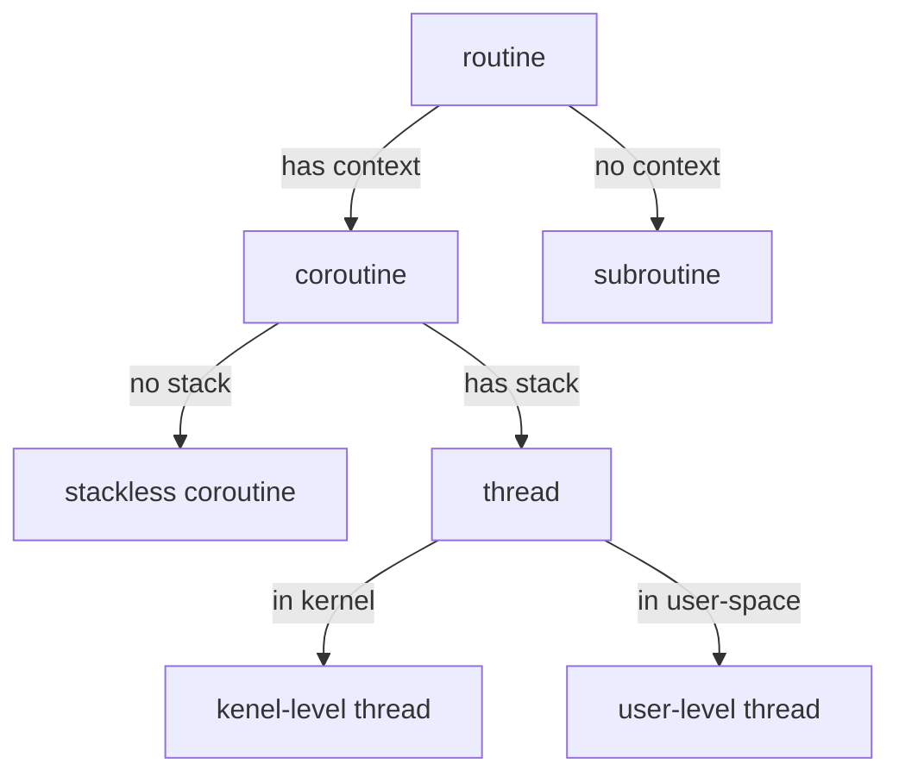

Paralellism과 concurrency를 지원하기 위해 다양한 실행 단위(Execution Unit)가 존재한다.
가장 기초적인 프로세스와 스레드부터 그린 스레드(green thread), 코루틴(coroutine), 파이버(fiber) 등 비교적 일반적 개념과, 고루틴(Goroutine)처럼 특정 언어에만 존재하는 개념도 존재한다.
상당수의 기술 문서, 대화에서 이들 개념이 명확히 구분되지 않고 사용되고, 때로는 잘못 사용되는 경우도 많다.

이를 명확히 [구분하려는 글](https://stackoverflow.com/questions/3324643/processes-threads-green-threads-protothreads-fibers-coroutines-whats-the)은 몇 존재하지만, 그다지 만족스럽지 않아서 새로 정리해 본다.
되도록이면 각 개념을 최초로 소개하는 논문 혹은 문서를 참고하려고 했으며, 그 글에서 기존 방식과의 차이가 기술되어 있으면 이를 중점으로 소개한다.

## Process (프로세스)

프로세스는 교과서에서도 나오는 개념이다. 초창기 컴퓨터 시스템에서는 프로세스에 대한 여러 디자인이 있었던 것 같지만, 여기서는 가장 대중적으로 사용되는 UNIX-like 프로세스를 설명하겠다.
UNIX 논문에서는 프로세스와 이미지를 다음과 같이 설명한다[^journals/cacm/RitchieT74].

> A *process* is the execution of an image. While the processor is executing on behalf of a process, the image must reside in main memory; during the execution of other processes it remains in main memory unless the appearance of an active, higher-priority process forces it to be swapped out to the disk.

> An *image* is a computer execution environment. It includes a memory image, general register values, status of open files, current directory and the like. An image is the current state of a pseudo-computer.

프로세스는 하나의 컴퓨터에서 여러 pseudo-computer를 안전하게 실행시키기 위해 등장하였다.
따라서, 프로세스는 각 독립적인 이미지를 가지고 있으며, 각 프로세스는 독자적인 메모리 공간, 프로세서 상태, 파일 시스템 상태를 지니고 있다.

## Thread (스레드)

UNIX 논문에는 thread에 대한 설명이 없다. 아직 멀티프로세서가 대중화되기 이전이라, 고성능 paralell 프로그래밍을 위한 스레드 지원이 필요하지 않았던 것으로 추측된다.
4.3 BSD까지 개발될 때 까지 스레드 지원은 없었고, 멀티프로세서를 지원하는 Mach 커널에서 현대적으로 사용되는 스레드가 등장하기 시작했다.

Mach 커널은 프로세스를 테스크와 스레드로 분리하였다[^conf/usenix/AccettaBBGRTY86]. 논문에서는 다음과 같이 설명한다.

> A *task* is an execution environment in which threads may run. It is the basic unit of resource allocation. A task includes a paged virtual address space and protected access to system resources (such as processors, port capabilities and virtual memory). The UNIX notion of a process is, in Mach, represented by a task with a single thread of control.

> A *thread* is the basic unit of CPU utilization. It is roughly equivalent to an independent program counter operating within a task. All threads within a task share access to all task resources.

Mach 논문은 프로세스와 테스크를 구분하여 용어를 사용한다.
UNIX 프로세스 개념이 소개될 당시에는 프로세스가 하나의 컨트롤(스레드)만 가지고 있었기 때문에, 프로세스를 이를 지칭할 때만 사용하고, 현대의 프로세스 개념은 테스크라는 단어를 사용한다.

테스크와 스레드를 요약하면, 테스크는 메모리영역과 시스템 리소스의 모음이고, 스레드는 연산의 기본 단위이다. 현대의 프로세스처럼 하나의 테스크는 여러 스레드를 가지고 있고, 이 스레드들 사이에서는 메모리 영역과 시스템 리소스를 공유한다.

## Coroutine (코루틴)

Mach 논문에도 언급되듯이, 스레드가 등장하기 전, UNIX 프로세스의 높은 오버헤드를 줄이기 위해 코루틴을 사용하고 있었다.
코루틴은 초기 컴파일러 연구서부터 등장하고 정확한 정의가 있지는 않은 것으로 보이지만,
이 글에서는 애플리케이션에서 독립된 컨택스트(최소 program counter)를 가지고 있는 루틴을 코루틴지칭하기로 한다. (이는 다소 엄밀한 정의는 아니다. 엄밀히 coroutine은 서로를 호출하는 동등한 루틴을 말하고, 서브루틴은 코루틴의 특별한 경우를 지칭한다[^books/lib/Knuth97].)
UNIX의 프로세스는 스레드가 없었기 때문에, 코루틴을 사용해야만 하나의 애플리케이션에서 여러 컨택스트를 가질 수 있었다.
이 때문에 스레드가 등작하기 전에 멀티프로세스의 리소스 오버헤드를 줄이거나 모듈화를 위해 코루틴이 사용되었었다.
코루틴들은 (당시에도) 유저레벨 프로세스 안에서 동작했기 때문에, 코루틴 사이에서 메모리 영역과 프로세스 리소스(파일 디스크립터 등)를 공유하게 된다.

### User-level Thread (유저레벨 스레드)

지금까지 설명을 살펴보면 스레드와 코루틴이 비슷한 특징을 가지는 것을 알 수 있다.
리소스 사용량을 줄이기 위해서 두 기법 모두 다 테스크(혹은 프로세스)의 메모리 영역과 리소스를 공유하고, 스레드와 코루틴 모두 독자적인 실행 컨텍스트를 지니고 있다.

따라서, 코루틴을 이용해서 스레드와 유사한 기능을 하는 유저레벨 스레드를 만들 수 있다.
Mach 커널에서 스레드 라이브러리(C-Thread)를 개발할 당시에도, 개발자들은 이를 인지하고 있었고 스레드를 코루틴을 이용하여 유저레벨에 구현하는 방법과 커널에 새로 구현하는 방법을 고민했었다.
하지만 코루틴은 다음과 같은 문제가 있기 때문에 커널레벨 스레드가 등장하게 되었다.

* 스케줄링이 어렵다. Non-preemtable 스케줄링만 가능
* Parallel 실행이 어렵다.
* 페이지 폴트 혹은 트랩이 발생할 경우 모든 코루틴이 기다려야 한다.
* 시스템 콜 호출시 모든 코루틴이 블록된다.

그럼에도, 코루틴 기반의 유저레벨 스레드는 컨택스트 스위칭이 빠르고 순서가 정해져 있다는 장점이 있어서 현대에도 종종 사용된다.

### 기타 용어

구현 및 기능상의 디테일은 조금 다르지만 다음 용어는 유저레벨 스레드 혹은 코루틴을 지칭한다.
이들의 자세한 차이점은 다음 글에서 설명하도록 하겠다.

* Green Thread[^books/daglib/0096707]: Java의 유저레벨 스레드를 지칭할 때 주로 사용된다. Java 그린팀이 제작했기 때문에 이런 이름이 붙여졌다.
* [Fiber](https://learn.microsoft.com/en-us/windows/win32/procthread/fibers): 주로 Microsoft Windows에서 사용하는 유저레벨 스레드를 지칭한다.
* Protothread[^conf/sensys/DunkelsSVA06]: 주로 임베디드 환경에서 stackless 코루틴을 지칭한다. (엄밀히는 스택이 없기 때문에 스레드의 기능을 수행하지 못한다.)
* Goroutine[^journals/cacm/CoxGPTT22]: Go 언어에서 사용하는 유저레벨 스레드를 지칭한다.

## Virtual Processor

Virtual Processor(Solaris등에서는 Lightweight process라 지칭)는 유저 스레드와 커널 스레드 중간에 위치한 레이어이다[^conf/usenix/EykholtKBFSSVWW92].
스레드 라이브러리는 커널로부터 커널 스래드를 할당 받고 이를 virtual processor로 활용한다.
사용자가 스레드 인터페이스를 이용하면, 라이브러리는 유저레벨 스레드를 동적으로 virtual processor에 할당하여 실행하는 방식이다.
이 방식을 사용하면, 유저레벨 스레드와 커널레벨 스레드의 장점을 모두 활용할 수 있게 된다.
특히, 유저레벨 스레드의 단점이었던 parallelism을 이용할 수 있게 된다.

## 결론

지금까지 설명한 정의에 따라 각 개념을 정리하면 다음과 같다.
이 정의는 다소 개인적이고 엄밀하지는 않지만, 대화할 때 무리는 없을 정도는 되는 것 같다.
다음 글에서는 user-level 스레드의 구현상의 차이를 비교해 보도록 하겠다.

<!-- pusnow reference start -->
[^journals/cacm/RitchieT74]: Dennis Ritchie and Ken Thompson. *The UNIX Time-Sharing System*. Commun. ACM 17(7)
[^conf/usenix/AccettaBBGRTY86]: Michael J. Accetta, Robert V. Baron, William J. Bolosky, David B. Golub, Richard F. Rashid, Avadis Tevanian, and Michael Young. *Mach: A New Kernel Foundation for UNIX Development*. In USENIX Summer 1986
[^books/lib/Knuth97]: Donald Ervin Knuth. *The art of computer programming, Volume I: Fundamental Algorithms, 3rd Edition*. Addison-Wesley, 1997
[^books/daglib/0096707]: Scott Oaks and Henry Wong. *Java threads - Java 2 (2. ed.)*. O'Reilly, 1999
[^conf/sensys/DunkelsSVA06]: Adam Dunkels, Oliver Schmidt, Thiemo Voigt, and Muneeb Ali. *Protothreads: simplifying event-driven programming of memory-constrained embedded systems*. In SenSys 2006
[^journals/cacm/CoxGPTT22]: Russ Cox, Robert Griesemer, Rob Pike, Ian Lance Taylor, and Ken Thompson. *The Go programming language and environment*. Commun. ACM 65(5)
[^conf/usenix/EykholtKBFSSVWW92]: Joseph R. Eykholt, Steve R. Kleiman, Steve Barton, Roger Faulkner, Anil Shivalingiah, Mark Smith, Jim Voll, Mary Weeks, and Dock Williams. *Beyond Multiprocessing: Multithreading the SunOS Kernel*. In USENIX Summer 1992
<!-- pusnow reference end -->