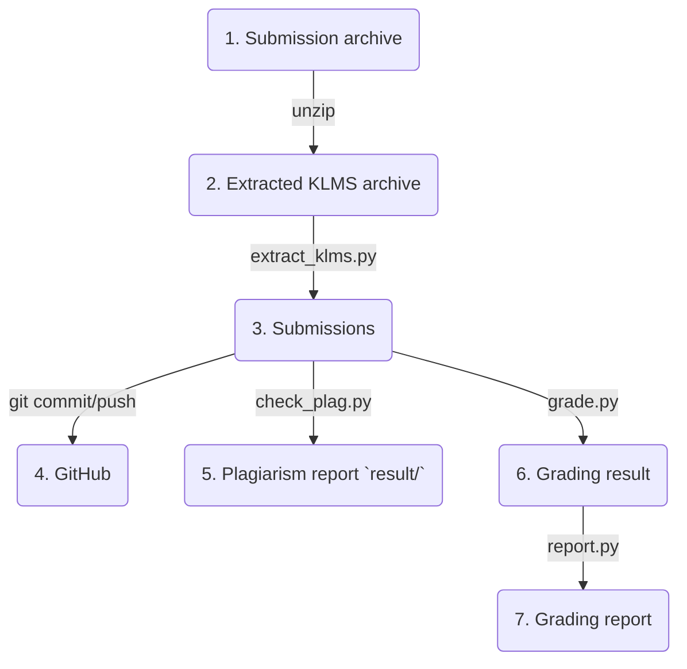

* [Source code available](https://github.com/ANLAB-KAIST/KENSv3)
* [Part 1](https://www.pusnow.com/note/kens-renewal-part1/)
* [Part 2](https://www.pusnow.com/note/kens-renewal-part2/)

## 지속가능성

언제까지고 내가 KENS 수업 조교를 할 수는 없다.
다음에 다른 조교가 쉽게 조교 활동을 할 수 있도록 개편하여 지속가능한 에코시스템을 개발하는 것이 이번 리뉴얼의 마지막 목표였다.
이를 위해서 KENS 과제 자료를 문서화, 조교 활동에 수반하는 반복적인 작업을 자동화, 그리고 지식 베이스 조성을 시도하였다.
모든 것이 완벽하다고 할 수는 없지만 어느정도 성과가 있어 이를 공유한다.
마지막으로, 현재까지 개발된 KENS의 한계점과 향후 개선 방향에 대하여 정리해 보았다.

## 문서화

기존 KENS 시스템은 간단한 소개 슬라이드와 [API 문서 홈페이지](http://anlab-kaist.github.io/KENSv3/doc/)가 전부였다.
학생들은 과제를 처음 시작하는 것부터 어려움을 겪어서 답답함을 호소하는 학생이 많이 있었다.
또, 학생들은 프레임워크에 특정 기능을 사용하기 위해서 어떤 메소드를 호출해야 하는지를 모르기 때문에 API 문서에 익숙하지 않은 학생들은 과제 진행이 매우 어려웠다.
그래도 과제를 수행하는데 필요한 프레임워크의 기능은 많지 않기 때문에, 한번 이 기능들을 익히면 프레임워크로 사용법으로인해 어려움을 겪지는 않게 된다.

학생들이 프레임워크 사용법을 빨리 익히기 위해 GitHub의 Wiki 기능을 활용하여 [KENSv3 Wiki](https://github.com/ANLAB-KAIST/KENSv3/wiki)를 개설하였다.
이 위키에서는 과제를 수행하기 위해 개발환경 조성 방법, 과제 소개 및 여러 팁 등 완벽하지는 않지만 과제 수행에 필요한 모든 정보를 한 곳에 모아 두었다.
또한, GitHub가 제공하는 검색 기능을 이용하면 이 위키 내용은 물론 소스코드와 뒤에서 설명한 지식 베이스의 내용까지 한 번에 검색할 수 있어서 학생들의 편의를 도모하였다.

## 자동화

조교 활동은 여러 반복되는 작업의 연속이다.
매 학기 같은 수업을 진행할 뿐아니라, 매 과제도 채점과 표절검사 등 반복되는 작업의 연속이다.
또, KENS의 버전업이 지속됨에 따라 변경되는 문서 생성, 호환성 테스트, 솔루션 빌드, 컨테이너 이미지 빌드 등의 작업도 지속적으로 이뤄져야 한다.
추후 조교가 변경되더라도 위 작업들을 쉽게 진행할 수 있는 시스템을 구축하는 것이 목표였다.

학생들의 과제물을 관리하는 작업은 과제 파이프라인을 이용한다.
다음은 KENS 과제 파이프라인으로 학생들이 KLMS(KAIST Learning Management System)에 제출된 과제물들이 어떻게 처리되는가를 보여준다.

1. 학생들이 제출한 과제물들은 KLMS에서 압축 파일로 한번에 다운로드 받을 수 있다.
2. 압축을 해제하면 학번과 이름으로 구성된 각 제출물이 나타난다.
3. `extract_klms.py` 스크립트를 이용해서 KLMS 제출물을 정리하여 과제물 데이터베이스에 추가한다.
4. 추후 표절 검사에 활용하기 위해 비공개 GitHub 저장소에 저장한다.
5. `check_plag.py` 스크립트를 활용하여 지금까지 제출된 과제들을 모두 비교하여 표절 여부를 확인한다.
6. `grade.py` 스크립트를 이용하여 제출물을 채점한다. 채점은 컨테이너 이미지를 활용하여 동시에 독립된 환경에서 수행한다.
7. `report.py`를 이용하여 채점 결과를 정리 리포트를 생성한다.

학생들 제출물을 관리하는 작업을 제외하고는 많은 작업들이 GitHub Actions를 이용하여 CI를 이용한 자동화를 진행하였다.
[API 문서 생성 및 배포](https://github.com/ANLAB-KAIST/KENSv3/actions/workflows/doxygen.yml), 호환성 테스트([리눅스](https://github.com/ANLAB-KAIST/KENSv3/actions/workflows/test-linux.yml), [리눅스2](https://github.com/ANLAB-KAIST/KENSv3/actions/workflows/test-linux-extra.yml), [WSL](https://github.com/ANLAB-KAIST/KENSv3/actions/workflows/test-wsl.yml), [macOS](https://github.com/ANLAB-KAIST/KENSv3/actions/workflows/test-macos.yml)), [컨테이너 이미지 빌드 및 배포](https://github.com/ANLAB-KAIST/KENSv3/actions/workflows/docker-publish.yml), 솔루션 빌드(비공개) 등이 GitHub Actions를 이용하여 진행된다.
특히 마지막 솔루션 빌드는 OS(Linux, macOS) 및 컴파일러 버전(GCC, AppleClang)별로 별도의 환경을 구축을 해야만 수행이 가능한데, GitHub Actions를 이용하면 쉽게 개발 환경을 대여해 사용할 수 있어서 쉽게 솔루션을 빌드할 수 있었다.

## 지식 베이스

조교 활동의 많은 부분은 학생들의 질문에 답하는 것이다.
학생들은 매우 다양한 질문을 하고 어떤 경우에는 KENS, 네트워크 스택 및 POSIX에 대한 깊은 이해가 없으면 답변하기 어려운 것들도 많이 질문한다.
이런 질문을 답변하기 위해서는 몇 학기 정도 지속적으로 KENS 조교로 활동하여 관련 노하우가 쌓여야 한다.
하지만, KAIST에서는 길어야 3년(석박사과정 총 합) 정도를 조교로 활동하게 되는데, 노하우가 생길 때가 되면 더이상 조교를 하지 않게 된다.
이 시스템에서는 매우 정교한 인수인계를 진행하지 않는 한, 세대를 거듭함에 따라 노하우의 유실이 발생하고 결과적으로 다음 조교가 처음부터 노하우를 쌓아 올려야 하는 비효율성이 발생한다.

이 문제를 현실적으로 해결하기 위해서 지식 베이스를 구축하기로 했다.
학생들과의 질의응답 과정을 저장하고 다음에 비슷한 질문을 가진 학생이 검색을 통하여 스스로 문제를 해결하게 된다면, 전문성있는 조교의 필요성이 줄어들게 되고 질의응답을 통해 발생한 노하우가 영속적으로 전승되게 된다.

지식 베이스를 구축하는 방법은 다양하지만, GitHub Discussion을 선택하기로 했다.
기존에 질의응답을 위해 사용하던 KLMS의 질의응답 게시판은 매 학기 새로 생성되기 때문에 전 학기의 질의응답 내용을 검식 및 열람할 수 없다.
지식 베이스의 구축 목적이 노하우의 영속이므로 이는 적합한 선택이 아니었다.
그 밖에 Stack Overflow, Confluence 등 기능이 많고 강력한 지식 베이스 소프트웨어를 검토했지만, 다음 이유로 GitHub Discussion을 선택하였다.

* GitHub Discusstion을 이용하기 위해서 대부분의 전산학부 학생은 GitHub 계정을 가지고 있어서 따로 가입할 필요가 없고, GitHub에 친숙하기 때문에 사용에 큰 어려움이 없다.
* KENS와 관련된 자료(소스코드, 문서, 위키)는 GitHub로 관리되어 접근이 편리하고, 검색 기능을 이용하면 소스코드, 문서, 위키 자료가 한번에 검색이 된다.
* GitHub Editor의 다양한 기능을 활용할 수 있다.

[KENSv3 GitHub Discussion](https://github.com/ANLAB-KAIST/KENSv3/discussions)을 도입하고 한학기 수업을 진행을 했었다.
여전히 KLMS 질문 게시판 및 이메일 등 Discussion을 제외한 다른 채널로 질문을 하는 학생들이 있었지만, 영속하는 지식 베이스 구축을 위해서 모두 GitHub Discussion을 이용하라고 안내했다.
또, 기존에는 따로 오피스아워를 마련하여 프로젝트 관련 질의응답을 하는 경우도 있었는데, 여기서 발행하는 질의응답 또한 남겨두기 위해 정말 필요한 경우가 아닌한 Discussion을 이용하게 했다.
질의응답 인터페이스의 개선으로 많은 중복되는 질문을 없엘 수 있었으며 다음 학기에도 다른 조교와 학생이 질의응답 내용을 검색 및 열람할 수 있게 되었다.

GitHub Discussion은 GitHub Editor를 사용하기 때문 추가적인 장점을 가져왔다.
[이 질의응답 과정](https://github.com/ANLAB-KAIST/KENSv3/discussions/58)처럼 소스코드를 참조할 때 자동적으로 링크와 렌더링되어 학생들의 편의를 도모할 수 있었고, 이 기능을 Linux 매뉴얼 파일 및 RFC를 참조할때 유용하게 활용할 수 있었다.

## 남은 과제

### 프로그래밍 언어 접근성

### 멀티플렉싱

### 다양한 과제

## 결론

