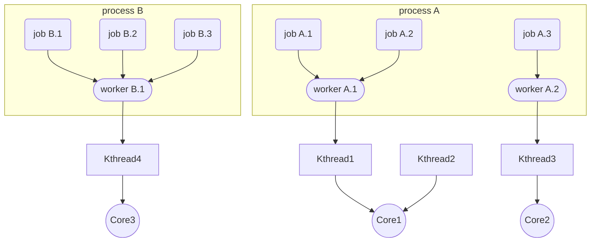

이 글에서는 다양한 유저-레벨 스케줄러들의 디자인과 구현을 비교 분석해 본다.

## 하이레벨 디자인 및 용어

유저-레벨 스케줄러는 각자 역사적 배경이 다르고 독립적으로 개발되어 왔기 때문에, 각 시스템에서 사용하는 단어는 천차만별이다.
하지만, 구현상의 디테일만 차이가 날 뿐, 대부분 아래의 추상적 개념에 매핑이 된다.
따라서, 이 글에서는 아래의 디자인과 용어로 통일하여 설명하도록 하겠다.

* Job: 독자적인 컨텍스트(최소 program counter)를 가지는 최소한의 실행 단위. Process에 속하는 Job 끼리는 같은 주소 공간, 커널 리소스(파일 디스크립터 등)를 공유.
* Worker: 커널 스레드와 1:1 매핑된 스레드 (예시, Linux's pthread).
* Kthread: 커널 스레드
* Core: 물리적 코어

## 구현 분석 가이드

* 컨텍스트
* 스케줄러 여부
* Syscall 호출
* Exception 발생
* Preemptive vs Cooperative

## 비교 대상

* Green Thread[^books/daglib/0096707]: Java의 유저레벨 스레드를 지칭할 때 주로 사용된다. Java 그린팀이 제작했기 때문에 이런 이름이 붙여졌다.
* [Fiber](https://learn.microsoft.com/en-us/windows/win32/procthread/fibers): 주로 Microsoft Windows에서 사용하는 유저레벨 스레드를 지칭한다.
* [Boost Fiber](https://www.boost.org/doc/libs/1_82_0/libs/fiber/doc/html/index.html)
* Protothread[^10.1145/1182807.1182811]: 주로 임베디드 환경에서 stackless 코루틴을 지칭한다. (엄밀히는 스택이 없기 때문에 스레드의 기능을 수행하지 못한다.)
* Goroutine[^10.1145/3488716]: Go 언어에서 사용하는 유저레벨 스레드를 지칭한다.

<!-- pusnow reference start -->
[^books/daglib/0096707]: Scott Oaks and Henry Wong. *Java threads - Java 2 (2. ed.).* O'Reilly, 1999.
[^10.1145/1182807.1182811]: Adam Dunkels, Oliver Schmidt, Thiemo Voigt, and Muneeb Ali. *Protothreads: simplifying event-driven programming of memory-constrained embedded systems.* Proceedings of the 4th international conference on Embedded networked sensor systems. [https://dl.acm.org/doi/pdf/10.1145/1182807.1182811](https://dl.acm.org/doi/pdf/10.1145/1182807.1182811)
[^10.1145/3488716]: Russ Cox, Robert Griesemer, Rob Pike, Ian Lance Taylor, and Ken Thompson. *The Go programming language and environment.* Communications of the ACM 65, 5. [https://dl.acm.org/doi/pdf/10.1145/3488716](https://dl.acm.org/doi/pdf/10.1145/3488716)
<!-- pusnow reference end -->